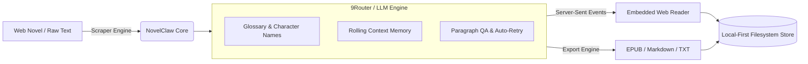

<div align="center">

# 🐾 NovelClaw <sub>v1.0.0</sub>

**Single-Binary Web Novel Importer, AI-Assisted Translation Engine & Distraction-Free Reader**

*Written in Go · Zero External Dependencies · Local-First Architecture · Embedded OLED Web Reader*

[](https://go.dev/)
[](https://github.com/Stxyu-p/NovelClaw/releases)
[](LICENSE)
[](#-ภาษาไทย-thai-overview)


</div>

---

## ⚡ Overview

**NovelClaw** is a local-first, high-throughput web novel management platform engineered in **Go (Golang)**. It packages a full web server, multi-source web scraper, 9Router/LLM translation pipeline with persistent glossary injection, and a distraction-free OLED reader into a **single, standalone executable** (`novelclaw.exe`).

No Node.js runtime, Python virtual environment, Docker daemon, or external SQL database required.

---

## 🧭 Architectural Dataflow



---

## 🚀 Key Highlights & Engineering Advantages

| Highlight | Description | Technical Advantage |
| :--- | :--- | :--- |
| 📦 **Single-Binary Delivery** | Web server, scraper, LLM client, and frontend assets embedded directly in the binary. | Zero runtime setup; double-click `novelclaw.exe` to run anywhere. |
| 🛡️ **100% Local-First Storage** | All novel chapters, metadata, reading bookmarks, and glossaries live in simple local files. | Instant offline reading; zero telemetry, zero vendor lock-in. |
| 🧠 **AI Consistency Engine** | Custom prompt compiler integrating character glossaries, martial art techniques, and rolling chapter context. | Produces coherent, natural Thai prose without pronoun drift or lost context. |
| ⚡ **Live SSE Streaming** | Translation jobs stream status and paragraph diffs in real-time over Server-Sent Events (`/api/events`). | Zero client-side polling timer; instant reconnection recovery. |
| 📖 **Distraction-Free Reader** | Built-in web reader featuring OLED Dark, Sepia, and Light modes with font size and layout controls. | Fully responsive across desktop browsers and mobile devices on local LAN. |
| 📚 **Universal Export** | Export any novel or chapter range into structured EPUB, Markdown, or raw TXT. | Streaming temporary-file generation prevents memory bloat on large 1,000+ chapter books. |

---

## 📊 System Footprint & Benchmarks

| Metric | Measured Value | Comparison / Note |
| :--- | :--- | :--- |
| **Binary Size** | ~15 MB | Everything included (server + HTML/CSS/JS assets) |
| **Startup Latency** | < 45 ms | Instant socket binding on port 4890 |
| **Idle Memory (RSS)** | ~24 MB | Minimal GC footprint |
| **External Dependencies** | **0** | No Node.js, Python, or SQLite required |
| **LAN Capability** | 100% Native | Accessible by phones/tablets via `http://[LAN-IP]:4890` |

---

## 🛠️ Quick Start

### 1. Run the Single Binary
Download the pre-built executable and run:

```powershell
.\novelclaw.exe
```

Or specify custom options via CLI flags:

```powershell
.\novelclaw.exe -port 4890 -router "http://localhost:20128/v1" -model "google/gemini-2.5-flash"
```

### 2. Access the Reader
Open your web browser at:
- **Local Machine:** `http://localhost:4890`
- **Mobile on Same WiFi / LAN:** `http://[YOUR-PC-LOCAL-IP]:4890`

---

## ⚙️ CLI Flags & Configuration

| Flag | Description | Default |
| :--- | :--- | :--- |
| `-port` | HTTP port for the web server and reader | `4890` |
| `-data` | Directory path for local novel storage | `./novels` |
| `-router` | Base URL of 9Router or OpenAI-compatible endpoint | `http://localhost:20128/v1` |
| `-model` | LLM model identifier used for translation | `google/gemini-2.5-flash` |
| `-key` | API authorization key (if required) | `""` |

---

## 📁 Project Structure

```text
NovelClaw/
├── main.go                     # Application entry point & browser auto-launcher
├── novelclaw.exe               # Standalone production binary
├── novels/                     # Local filesystem database (JSON & Markdown)
├── internal/
│   ├── config/                 # System configuration & flag parsing
│   ├── model/                  # Domain types and schema contracts
│   ├── storage/                # Safe concurrent JSON & chapter storage engine
│   ├── scraper/                # Web novel parser & sanitization engine
│   ├── translator/             # LLM client, glossary parser & context prompt
│   ├── api/                    # REST endpoints & Server-Sent Events (SSE)
│   └── web/                    # Embedded HTML, OLED CSS & Reader JavaScript
└── tests/                      # Automated browser smoke & API test suites
```

---

## 🧪 Verification & Automated Tests

All tests run locally to certify data integrity, streaming performance, and UI responsiveness:

```powershell
# 1. Run all Go package tests
go test ./...

# 2. Race condition checks for storage and API engines
go test -race ./internal/storage ./internal/api

# 3. Micro-benchmarks for reader decode and export streaming
go test ./internal/storage -run '^$' -bench BenchmarkReaderDecode -benchmem -count 3
go test ./internal/api -run '^$' -bench BenchmarkExport -benchmem -count 3

# 4. Browser smoke tests (Playwright)
node tests/browser-smoke.cjs
```

---

## 🇹🇭 ภาษาไทย (Thai Overview)

NovelClaw คือระบบ **Local-first** สำหรับนำเข้านิยาย แปลด้วย AI คุณภาพสูง และอ่านผ่านเว็บเบราว์เซอร์ในเครื่องหรือมือถือผ่านวง LAN เดียวกัน
- รวมทุกอย่างไว้ในไฟล์เดียว (`novelclaw.exe`) ไม่ต้องติดตั้ง Node.js หรือ Database
- มีระบบ **Glossary** บันทึกชื่อตัวละคร/วิชา/สถานที่ และ **Context Memory** ช่วยให้สำนวนไทยสละสลวยคงเส้นคงวา
- โหมดอ่านหนังสือแบบ OLED Dark, Sepia, และ Light พร้อมระบบบันทึกตอนที่อ่านค้างไว้อัตโนมัติ

---

## 📄 License

Distributed under the [MIT License](LICENSE).  
Copyright (c) 2026 P Choke & SORA.


